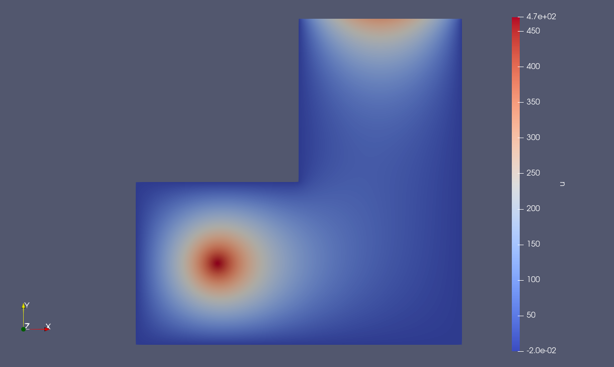

Что на картинке и какой смысл.

Моделируется установившаяся в комнате в форме уголка температура. Уравнение теплопроводности в станционарном случае (lambda=1): -Δu = f, где u - температура, f - объёмная плотность мощности.

Слева снизу стоит истоник круглый. В центре у него f велико и убывает с расстоянием. Тепмература всех стенок кроме верхней u = -0.02 - const (это условие Дирихле). У верхней стенки типа окно и там к центру поток тепла наружу возрастает (это условие Неймана).

Я думал получить распределение температуры если греет источник, открыто окно и стенки просто какие-то. Но получилось просто математическое решение задачи. Получился по смыслу расчет какую температуру надо поддерживать у окна (скажем, батареей), чтобы был именно такой поток.
